<div style="text-align:justify">

# CSS - Introducción.

**CSS** son las  siglas en inglés para *hojas de estilo en cascada* `Cascading Style Sheets`. Básicamente, es un lenguaje que maneja el diseño y presentación de las páginas web, es decir, cómo lucen cuando un usuario las visita. Funciona junto con el lenguaje **HTML** que se encarga del contenido básico de las páginas.

**¿Cómo funciona?**

`CSS` funciona como complemento a la información que forma parte de un sitio web. Mientras que el código `HTML` incluye todos los datos, el código en `CSS` se encarga de darles formato y presentarlos visualmente a través de un navegador.

<div style="text-align:center">


</div>

## Estructura Modular.

Para comenzar abordaremos primera la forma de trabajo que utilizaremos al desarrollar nuestras hojas de estilo. Como desarrolladores, la práctica recomendada es trabajar de manera `modular`. Esto significa organizar nuestro código en módulos separados según el lenguaje que estemos utilizando. Por ejemplo, tendremos un archivo para el lenguaje `HTML` y otro para el lenguaje `CSS`. Para aplicar esta metodología, primero debemos crear un documento `HTML` y luego vincularle un archivo `CSS` externo.

**¿Cómo haremos para importar un documento `CSS` al documento `HTML`?**

Para empezar, en nuestro documento `HTML` agregaremos en el *head* la etiqueta *link*. A esta etiqueta le asignaremos el atributo `rel="styleheet"` y el atributo `href="style.css"`. Veamos el siguiente código:
```html

<!DOCTYPE html>
<html lang="en">
<head>
    <meta charset="UTF-8">
    <meta name="viewport" content="width=device-width, initial-scale=1.0">
    <title>Document</title>
    <!--La siguiente linea es la vinculacion del módulo-->
    <link rel="stylesheet" href="style.css">
</head>
<body>
    
</body>
</html>

```
Hemos agregado el documento `CSS`, pero todavía no lo hemos creado. Para generarlo, debemos mantaner presionado la tecla `Ctrl` y hacer clic sobre la declaración del atributo `href`. 

<div style="text-align:center">

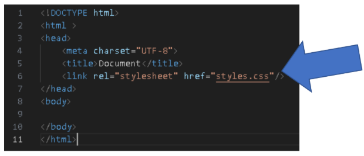

</div>

Nos emergera la siguiente ventana

<div style="text-align:center">

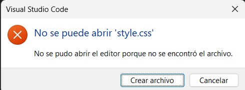

</div>

Daremos clic en `Crear archivo`.
<br>
Esto abrirá automáticamente un  nuevo archivo con ese nombre `style.css`, listo para editar.

<div style="text-align:center">

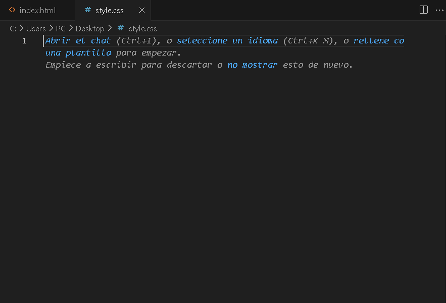

</div>

----

## Implementación de selectores

## Selector por nombre de elemento.

Para comenzar a implementar los selectores en `CSS`, primero necesitamos tener una etiqueta en nuestro documento `HTML` sobre la cual aplicar los estilos. En este caso, añadiremos una etiqueta `h1` con el contenido *Aprendiendo CSS*.

```html

<!DOCTYPE html>
<html lang="en">
<head>
    <meta charset="UTF-8">
    <meta name="viewport" content="width=device-width, initial-scale=1.0">
    <title>Document</title>
    <!--La siguiente linea es la vinculacion del módulo-->
    <link rel="stylesheet" href="style.css">
</head>
<body>
    <h1>Aprendiendo CSS</h1> <!--Elemento agregado -->
</body>
</html>


```
Una vez que hayamos creado la etiqueta `h1` en nuestro archivo `HTML`, nos dirigiremos al archivo `CSS` para aplicarle estilos. Para ello, seleccionaremos el elemento utilizando su nombre de etiqueta de la siguiente manera:

```CSS
    h1{

    }
```
Ya hemos seleccionado el elemento, ahora modificaremos el tamaño de su fuente. Para ello, centro de las llaves escribiremos la propiedad `font-size` con la declaración: `100px;`. *Recordá siempre finalizar cada declaración con un punto y coma.

```CSS
    h1{
        font-size: 100px;
    }
```

Volvamos a nuestro documento `HTML` para observar cómo se muestra el `h1` una vez modificado con `CSS`.

<div style="text-align:center">

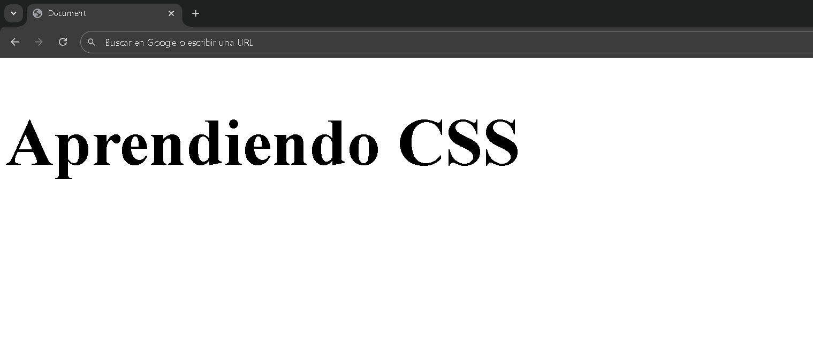

</div>

Cuando usamos un selector que llama a un elemento por su nombre, todas las declaraciones que escribamos dentro de ese selector se aplicarán a todos los elementos del mismo tipo en la página.
<br>
*¿A qué nos referimos con esto?* 
<br>

Imaginemos que tenemos tres botones distintos en nuestro documento `HTML`. Si utilizamos un selector de tipo de elemento (por ejemplo, `button`), todos esos botones compartirán los mismos estilos.

<br>

Por ejemplo, si indicamos que el tamaño de la fuente debe ser de 100 pixeles, los tres botones mostrarán el texto con ese tamaño.

```HTML
<body>
    <button>botón</button>
    <button>botón</button>
    <button>botón</button>
</body>
```
<br>
------

<div style="text-align:center">

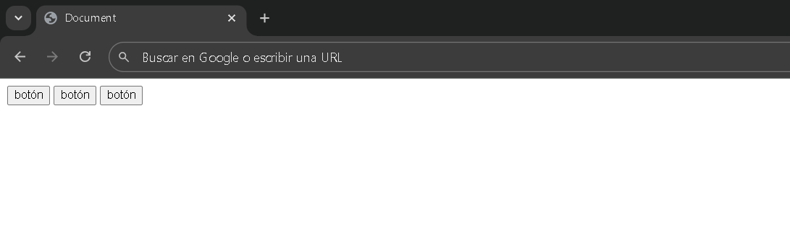

</div>

Los botones sin `CSS`.
<br>

------

Ahora vamos a plicar el selector de elemetos en nuestro archivo `CSS`. En este caso, seleccionaremos todos los elementos `button` y les asignaremos un tamaño de fuente de **100 píxeles**. Esto hará que todos los botones del documento se vean con una letra mucho más grande.

```CSS
    button{
        font-size: 100px;
    }
```
Veamos el documento `HTML`.

<div style="text-align:center">

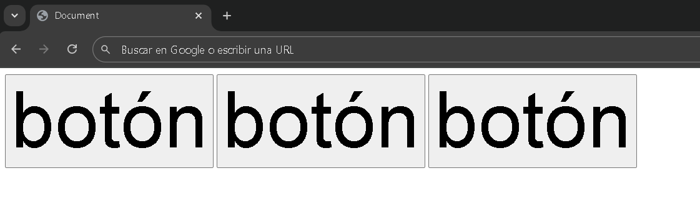

</div>

## Selector por `id`.

Pero, *¿cómo podríamos hacer para que solo uno de los tres botones tenga el tamaño de fuente de `100 píxeles`?*
<br>

Una forma de lograrlo es utilizando el selector por `id` en `CSS`.

Primero, debemos asignarle un atributo `id` al botón que queremos modificar. Luego, en nuestra hoja de estilos, lo llamamos escribiendo el signo `#` seguido del nombre `id` que hayamos dado al botón.
De esta manera, los estilos que definamos solo se aplicarán a ese botón en particular.
<br>

Veamos cómo sería esto en el código:

```html
<!DOCTYPE html>
<html lang="en">
<head>
    <meta charset="UTF-8">
    <meta name="viewport" content="width=device-width, initial-scale=1.0">
    <title>Document</title>
    <link rel="stylesheet" href="style.css">
</head>
<body>
   <button>botón</button>
   <button id="boton">botón</button><!--Aquí asignamos el id-->
   <button>botón</button>
</body>
</html>
```
Podemos observaar que al botón se le haaa asignado el atributo `id` con la declaración `boton` Este identificador nos permite aplicar estilos específicos solo a ese elemento.

A continuación, veamos cómo lo referenciamos en nuestra hoja de estilos `CSS`.

```CSS
    #boton{
        font-size: 100px;
    }
```
Llamamos al `id` del botón utilizando el símbolo `#` seguido de la declaración asignada al `id`.

Esto nos permite aplicar estilos únicamente a ese elemento en particular.
Veamos cómo queda en el documento `HTML`:

<div style="text-align:center">

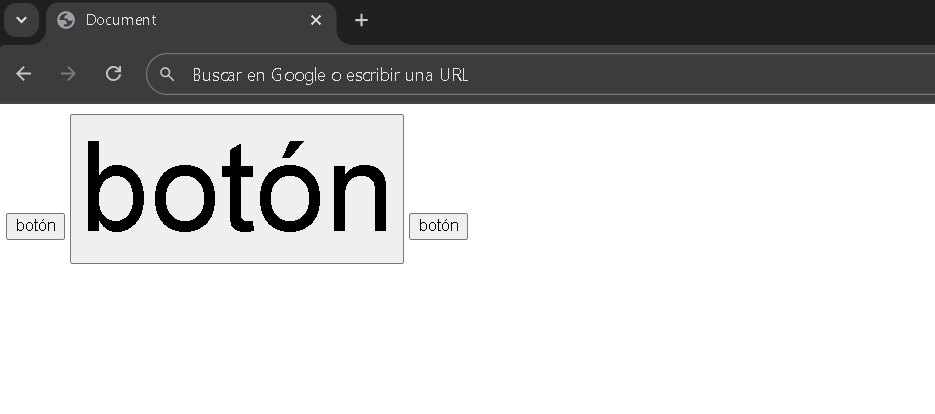

</div>

Como podemos observar, el botón del medio es el único que conserva un tamaño de fuente de 100 píxeles.

No obstante, surge una limitación al emplear el selector por `id` estos deben ser únicos y no pueden repetirse dentro del mismo documento. Esto implica que, si deseamos aplicar un mismo estilo a varios elementos, pero no a todos, la forma más adecuada y eficiente de hacerlo es mediante el uso de `clases`.

*Veamos un ejemplo para comprenderlo mejor:*

Supongamos que, de los tres botones disponibles, queremos que dos de ellos tengan un tamaño de fuente 100 píxeles y que el color del texto sea rojo. Para lograrlo, utilizaremos un selector de clase.

El primer paso es asignar a los elementos `button` un atributo `class` con el mismo nombre. Observemos el siguiente código como referencia:

```html
<!DOCTYPE html>
<html lang="en">
<head>
    <meta charset="UTF-8">
    <meta name="viewport" content="width=device-width, initial-scale=1.0">
    <title>Document</title>
    <link rel="stylesheet" href="style.css">
</head>
<body>
   <button class="botones">botón</button><!--Aquí asignamos la clase-->
   <button>botón</button>
   <button class="botones">botón</button><!--Aquí asignamos la clase-->
</body>
</html>
```
Asignamos el atributo `class` a los botones y le dimos a todos el mismo nombre: `botones`.

Ahora, echemos un vistazo al código `CSS` que utilizaremos para aplicar los estilos a esos elementos.

```CSS
.botnes{
    font-size: 100px;
    color: red;
}
```

*Vista al documento `HTML`*

<div style="text-align:center">

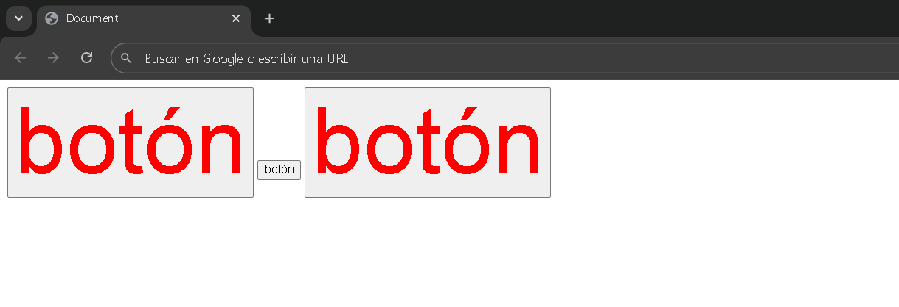

</div>

También es posible asignar una clase dentro de otra. Para ello, se puede otorgar un nombre  de clase y, a continuación, separándolo con un espacio, añadir otro nombre diferente. De esta manera, el elemento podrá heredar los estilos de ambas clases.

```html
<!DOCTYPE html>
<html lang="en">
<head>
    <meta charset="UTF-8">
    <meta name="viewport" content="width=device-width, initial-scale=1.0">
    <title>Document</title>
    <link rel="stylesheet" href="style.css">
</head>
<body>
   <button class="botones">botón</button><!--Aquí asignamos la clase-->
   <button>botón</button>
   <button class="botones verde">botón</button><!--Aquí asignamos 2 clases-->
</body>
</html>
```
En el atributo `class` hemos asignado dos clases distintas: `botones` y `verde`. Esto permitirá que el elemento adopte los estilos definidos tanto para la clase `botones` como para la clase `verde`. A continuación, observemos cómo queda nuestra codificación en `CSS`.

```CSS
.botones{
    font-size: 100px;
    color: red;
}
.verde{
    font-size: 100px;
    color: green;
}
```
En el primer bloque de código hacemos referencia a la clase `botones`, mientras que en el segundo bloque llamamos a la clase `verde`. Ahora, veamos cómo se refleja esto en nuestro documento.

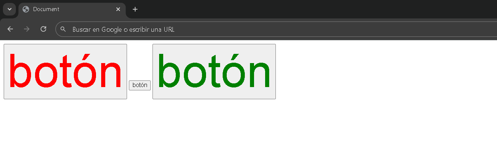

El primer botón adopta el estilo definido en el primer bloque de código, mientras que el tercer botón toma el estilo del segundo bloque. Ahora bien, ¿qué sucedería si asignamos a ambos botones la misma clase, pero con declaracionn de color diferentes? Para comprobarlo, mantendremos los colores actuales `uno rojo y el otro verde`, pero les asignaremos la misma clase a ambos botones.

```CSS
.botones{ /*Misma clase*/
    font-size: 100px;
    color: red;
}
.botones{ /*Misma clase*/
    font-size: 100px;
    color: green;
}
```
Como podemos observar, ambos botones están asignados a la misma clase. En el primer bloque de código se establece el color rojo, mientras que en el segundo se define el color verde. ¿Cuál creés que será el color predominante?¿El rojo o el verde?

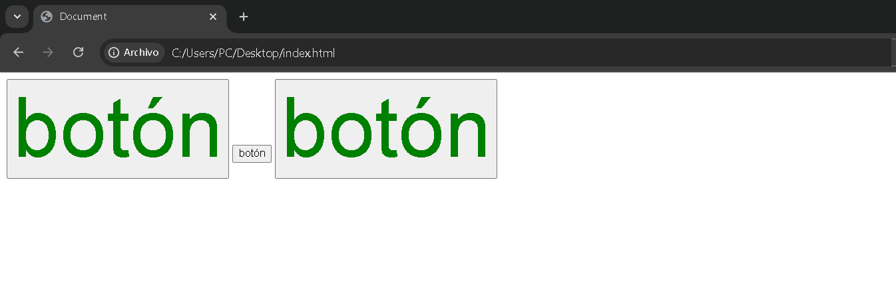

Si tu respuesta fue `el verde`, estabas en lo correcto.
pero, ¿por qué sucede esto?
En el lenguaje de estilos `CSS` existe un concepto llamado *especificidad*.

**¿Qué es la especificidad?**
La especificidad es el mecanismo que utilizan los navegadores para determinar qué valores de una propiedad `CSS` se aplicarán a un elemento cuando hay múltiples reglas en conflicto.
Está basada en un sistema de prioridades según el tipo de selectores utilizados en cada regla.
`CSS` asigna mayor importancia a ciertos selectores sobre otros, y esa jerarquía es la que define qué estilos prevalecen.

### Especificidad:

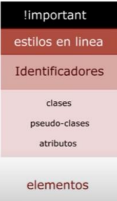

Esta es una tabla que muestra el nivel jerárquico de los selectores en `CSS`.
Pero, ¿Qué sucede si dos reglas tienen el mismo nivel de jerarquía, como en nuestro caso? 

Ahí entra en juego la regla de la **Cascada**: cuando hay empate en especificidad, prevalece la última declaración escrita en el código.

<br>
<hr>


## !important

Es una declaración especial en `CSS` que se utiliza para darle máxima prioridad a una regla específica.
Cuando se agrega `!important` a una propiedad, esta se aplicará sin importar si existen otras reglas que normalmente tendrian más peso  o especificidad.
En otras palabras, `!important` anula las demás reglas aplicables al mismo elemento.

```CSS
.boton
    {
        background-color: brown !important;
    }
```
Es importante tener en cuenta que el uso excesivo de `!important` puede dificultar la gestión de estilos dentro de un proyecto. Esto se debe a que una vez aplicado, puede resultar complicado sobrescribir esa regla si en el futuro se desea modificar el diseño. Por ello, se recomienda utilizar `!important` con moderación y dar prioridad a una buena organización del código y al uso adecuado de la especificidad en las reglas `CSS`.

**Posible impacto en el SEO**

Si el rendimiento de la página se ve afectado considerablemente por un uso excesivo de `!important`, esto podría repercutir negativamente en el posicionamiento en los motores de búsqueda. Plataformas como **Google** consideran el rendimiento del sitio web como un factor clave dentro de su algoritmo de ckasufucación.

## Estilo en línea

El estilo en línea consiste en aplicar reglas `CSS` directamente sobre un elemento `HTML` utilizando el atributo `style`. Esto implica que las declaraciones de estilo se escriben dentro de la misma etiqueta `HTML` del elemento que se desea personalizar.

```html
    <button style="background-color: blue; color: white;">Haz clic aquí</button>
```
## Estilo embebido

El estilo embebido se refiere a la definición de reglas `CSS` dentro del mismo documento `HTML`, utilizando la etiqueta `style`. Esta etiqueta suele colocarse dentro del elemento `head`, aunque también puede incluirse en el `body`, auqneu eno es lo más recomendable.

Este método permite aplicar estilos a varios elementos desde un solo bloque, sin necesidad de un archivo `CSS` externo.

```html
<!DOCTYPE html>
<html lang="en">
<head>
    <meta charset="UTF-8">
    <meta name="viewport" content="width=device-width, initial-scale=1.0">
    <title>Document</title>
    <style>
        h1
        {
            background-color: blueviolet;
        }
    </style>
</head>
<body>
    <h1>hola mundo</h1>
    <style>
        h1
        {
            background-color: red;
        }
    </style>
</body>
</html>
```
*Documento HTML:*

<div style="text-align:center">

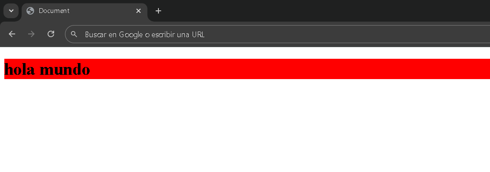

</div>

## Especificidad

**Estilo en línea**

Los estilos en línea poseen la mayor especificidad dentro de las reglas `CSS`. Esto significa que los estilos en línea prevalecerán sobre cualquier otra regla, ya sea interna o externa, siempre que afeccten a las mismas propiedades.

**Estilo embebido**

Los estilos internos, definidos dentro de una etiqueta `style` en el documento `HTML`, también tienen una especificidad considerable, aunque inferior a la de los estilos en línea. Se comportan como si fueran un único selector en la cascada de estilos. Por lo tanto, tienen más peso que las hojas de estilo externas, pero menos que las reglas en línea.

**Regla básica de CSS - Selectores.**

Una regla `CSS` siempre tiene un selector (el elemento al que quiero modificar) y una declaración (las características que le quiero agregar o cambiar). La declaración va encerrada entre llaves `{}` y dentro de ella se escriben todas las propiedades con sus valores, que modificarán al selector.

<div style="text-align:center">

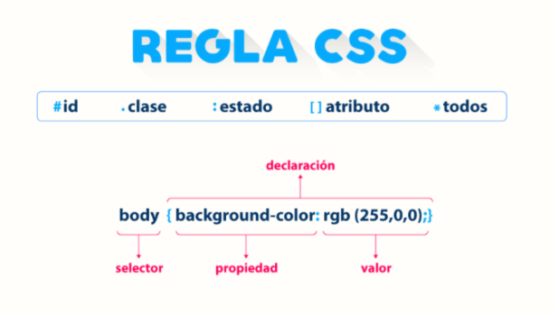

</div>

**¿ Cómo funciona un selector en CSS ?**

Un selector `CSS` es la primera parte de una regla `CSS`. Es un patrón de elementos y otros términos que indican al navegador qué elementos `HTML` se seleccionan para aplicarles una regla que incluye los valores de las propiedades `CSS`.

## Selector de indentificador (id)

El selector por indentificador en `CSS` se utiliza para aplicar estilos a un único elemento `HTML` que tenga un atributo `id` específicado. Los identificadores deben ser únicos dentro de un documento `HTML`, es decir, no se puede repetir el mismo `id` en más de un elemento del mismo documento.
Este tipo de selector es útil cuando se quiere aplicar un estilo exclusivo a un solo elemento.

**Ejemplo**:
- En `HTML`.

```html
    <button id="boton">bóton</button>
```
- En `CSS`
```CSS
#boton
    {
        background-color: brown;
    }
```
## Selector por clase
Los slectores por clases se utilizan para aplicar estilos a uno o más elementos `HTML` que comparten una misma clase. A diferencia de los indentificadores, las clases no tienen que ser únicas y pueden ser reutilizadas en varios elementos.

**Ejemplo**:
- En `HTML`.

```html
    <button class="boton">bóton</button>
```
- En `CSS`
```CSS
.boton
    {
        background-color: brown;
    }
```
## Selector Pseudo-clases.
Las pseudo-clases se utilizan para definir un estado especial de un elemento. Estas pueden aplicar estilos a un elemento cuando está en un estado particular, como cuando el usuario pasa el ratón sobre él o cuando un enlace ha sido visitado.

**Ejemplo**:

```CSS
a:hover
    {
        background-color: brown;
    }
```

## Selector de atributos.
Los selectores de atributos permiten aplicar estilos a elementos basándose en sus atributos y valores de atributos. Esto es útil para seleccionar elementos con atributos específicos o con ciertos valores en los atributos.

**Ejemplo**:

```CSS
input[input="text"]
    {
        background-color: brown;
    }
```
## Selector universal.
El selector universal en `CSS` se utiliza para aplicar estilos a todos los elementos de una página web. Se representa con iun asterisco `*` y es útil cuando deseas aplicar un estilo común a todos los elementos sin tener que especificarlo individualmente.

**Ejemplo**:

```CSS
*{
    color: red;
}
```

</div>


